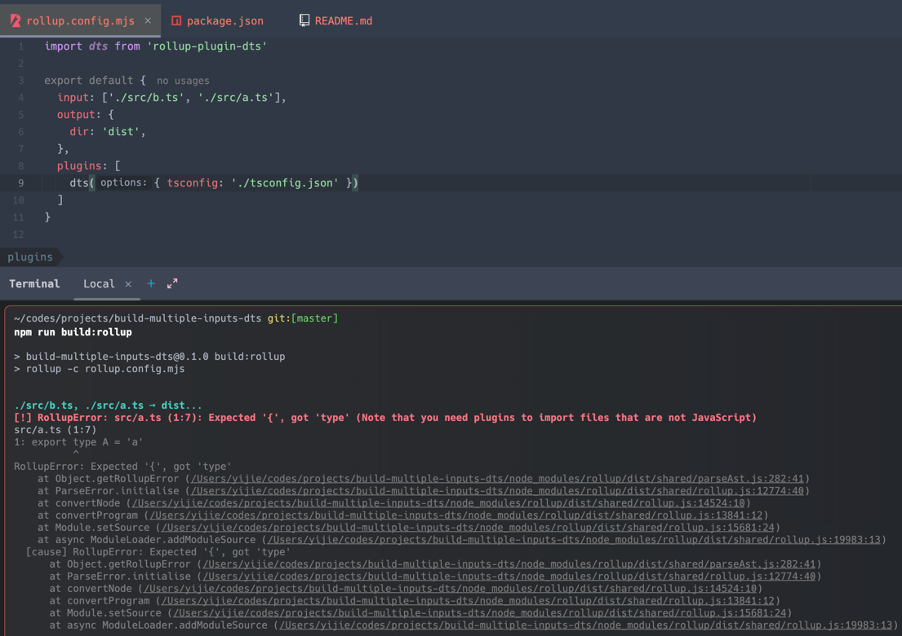
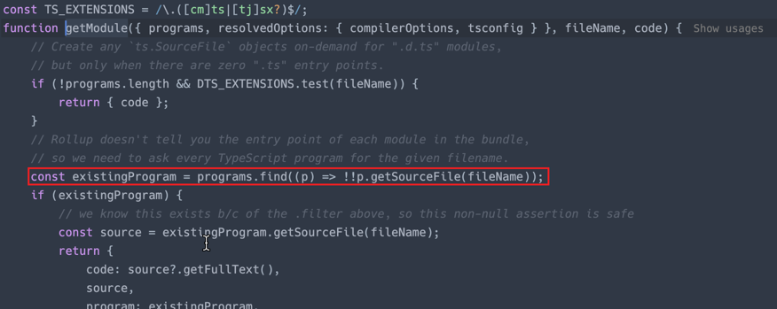
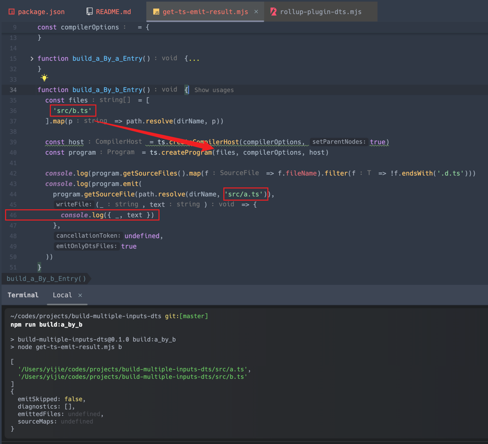
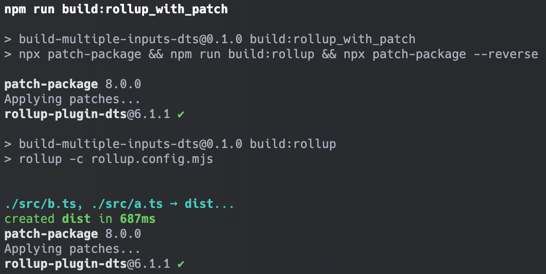

When I have a structure like this:
- `a.ts`
- `b.ts`
  And `b.ts` import `a.ts`.

And I have set both `a.ts` and `b.ts` as inputs to be used as exports.
Then, when using rollup dts, it will generate two separate compilation tasks for a and b respectively.
When I compile b first and then a, i.e., when the inputs are written as [`b.ts`, `a.ts`] (let's not worry about the order for now, as I have simplified the problem).

```bash
npm run build:rollup
```
It will throw an error:


The reason is that when compiling `a.ts`, the program is reused. However, since `b.ts` has already been compiled, the dependency of `a.ts` in `b.ts` is also recorded in the source files of the program corresponding to the entry point of `b.ts`.
When rollup dts detects that `a.ts` exists in the source files of the above `b_program`, it directly uses `b_program` instead of the program corresponding to `a.ts`.

```ts
const existingProgram = programs.find((p) => !!p.getSourceFile(fileName));
```
For this case, I have created a simulation that can run this command:
```bash
npm run build:a_by_b
```

Line 46 will never be output, which is the reason for the error reported by rollup-plugin-dts.

Therefore, here we need to check if the target file of toModule is an entry point. In this case, we need to find the corresponding program. I have a patch that fixes it.
```bash
npm run build:rollup_with_patch
```

